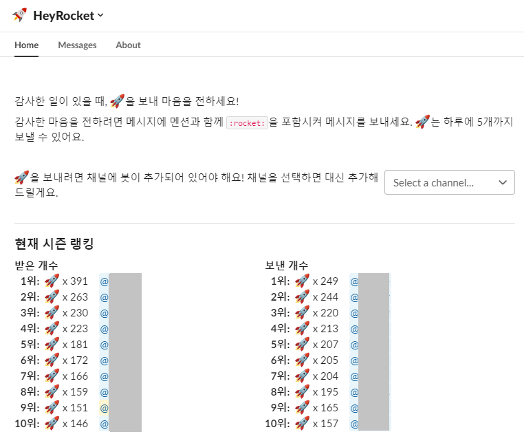

# HeyRocket

Slack에서 감사한 일이 있을 때, :rocket:을 보내 마음을 전하세요!

감사한 마음을 전하려면 Slack 메시지에 멘션과 함께 :rocket:을 포함시켜 메시지를 보내세요.

[Cloudflare Workers](https://workers.cloudflare.com/) 환경에서 동작합니다.



## 기능

- 슬랙 메시지로 로켓 발송
- 하루에 발송할 수 있는 로켓 개수 제한 (커스텀 가능)
- 랭킹 페이지

## 개발 환경 세팅

1. 리포지토리 클론하기
2. `yarn install`
3. `yarn start`

## 배포하기

1. D1 데이터베이스를 먼저 생성해야 합니다.
2. `wrangler.toml` 파일에서 D1 데이터베이스의 이름과 id를 방금 생성한 데이터베이스의 정보로 수정합니다.

```toml
[[ d1_databases ]]
binding = "DB"
database_name = "hey-workers"
database_id = "76fc4d4a-de91-4dbb-a294-9e3a0958ea32"
```

3. 필요한 Secret 값을 설정합니다.

```bash
$ echo <어드민 API 접근용 랜덤키> | wrangler secret put ADMIN_SECRET_KEY
$ echo <Slack API 봇에서 발급받은 Token> | wrangler secret put BOT_TOKEN
$ echo <Slack API 봇에서 발급받은 SIGNING_SECRET> | wrangler secret put SLACK_SIGNING_SECRET
```

Slack Signing Secret에 대한 정보는 다음 [링크](https://api.slack.com/authentication/verifying-requests-from-slack)를 참고하세요.
